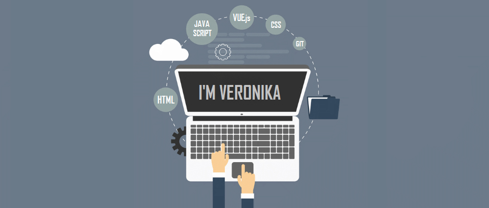

### Languages and Softwares:

<code></code>
<code></code>
<code></code>
<code></code>
<code></code>
<code></code>
<code></code>
<code></code>
<code></code>
<code></code>
<code></code>
<code></code>
 
<!--### Github Statistics:
-->

### Connect with me:
<code></code>
<code></code>
<code></code>
